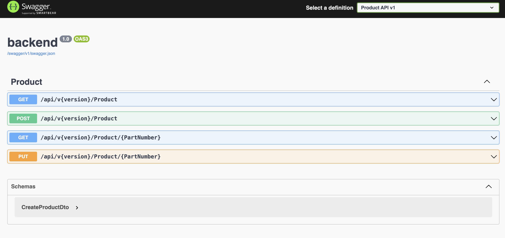
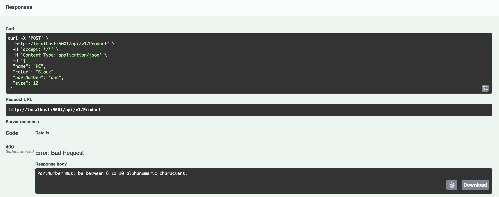
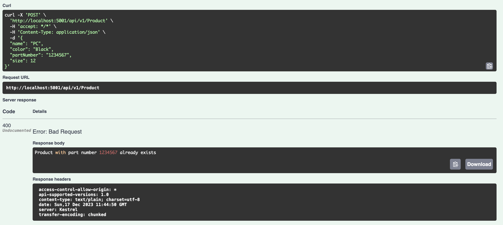
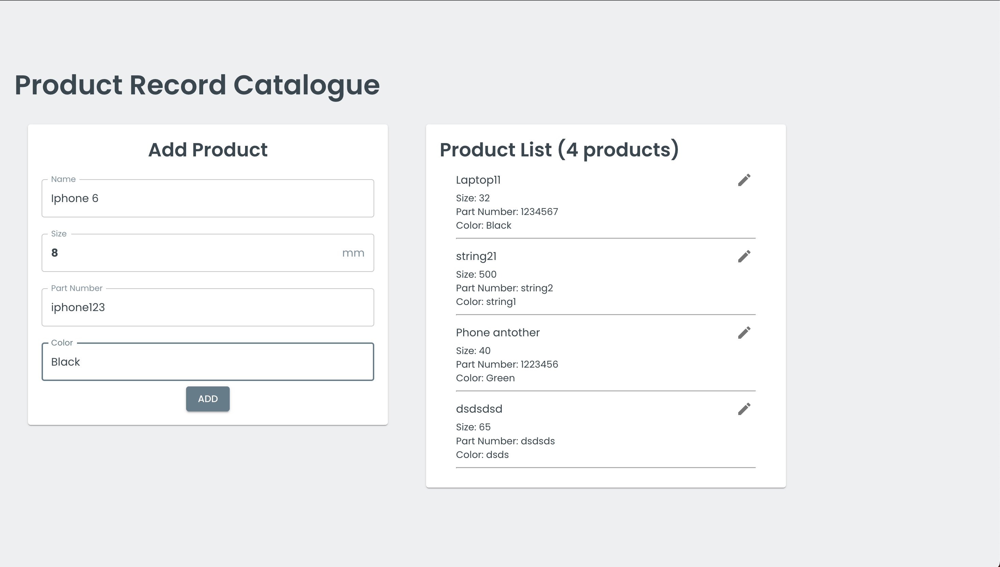
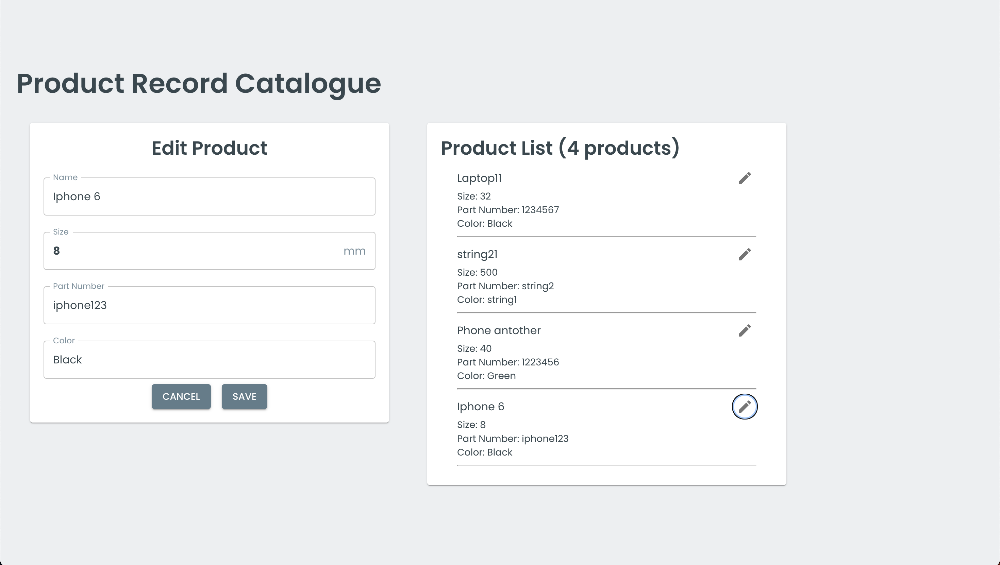

# flaekt

## Local development setup (Docker) - Recommended

Change into root directory:  `flaekt`

`docker compose up --build`

or if you don't want output (detached mode)

`docker compose up -d --build`

If you get an error regarding missing dependencies you need to rebuild the dev containers

`docker compose build`

## Local development setup

Change into `frontend` directory

`yarn install`
`yarn run start`

Change into `backend` directory

`dotnet run`

## Backend (PORT 5001)
The backend is an ASP.NET web application built using C# following the MVC pattern. The controller exposes 4 endpoints for performing basic CRUD operations; GET (by id and all), updating and creating. 

Note: Delete  wasn't implemented for this use case. 

An OpenAPI Spec is also provided that can be reached using [Swagger](http://localhost:5001/swagger/index.html). 

Note: No form of Authentication/Authorization was provided.

The various APIs also comes with versioning. Version 1 being used for this case.

### Worthy of Note:
1. While creating/updating products, various forms of validation is considered. For example the pathNumber must be unique and must contain between 6 - 10 Alphanumeric characters. 

2. No test was implemented. Unit Tests, E2E Test etc are not implemented.

## Backend (PORT 3001)
The frontend is a React App build using Vite, MUI, React Query. The idea was to have something very basic for the users so the design was considered.

Please consider the section for Running Locally or docker for how to Run the app. You should be able to access it using the link: [http://localhost:3001/](http://localhost:3001/). 

### Home Page / Add Product

### Edit Product

### Worthy of Note:
1. While creating/updating products, various forms of validation is considered. For example the pathNumber must be unique and must contain between 6 - 10 Alphanumeric characters. So the button to `add` gets disabled if this rule is not met. So the validation was done both at the frontend and the backend
2. No test was implemented. Unit Tests, E2E Test etc are not implemented.
3. Styled Components were used were needed.
4. React Query was used for State Management and mutating/getting Product data.

## Data Store
PostgreSQL was used as the storage. You could set this up locally yourself and update the connecting parameters but it is advisable to using the Docker-compose file provided for testing. I also included a `pg-admin` with username `admin@pgadmin.com` and password `admin`. 

Note: database migration may be required:  `dotnet ef migrations add <name>` and `dotnet ef database update` should be ran in the backend folder.

If everything go well, you should be able to access the `pg-admin` using this [http://localhost:5050/](http://localhost:5050/).

# NOTE (Possible improvements)
1. Tests were not written. I would like to write some test probably using Cypress for the frontend and xUnit/NUnit for the backend, but due to time constraint it is a bit hard. I am sorry but maybe we can talk about that (discussion) if this scales through.
2. Delete endpoint is not provided. This should "in theory" be easy to implement but same reason as number 1. 
3. Redis would also be a decent option if caching is required.
